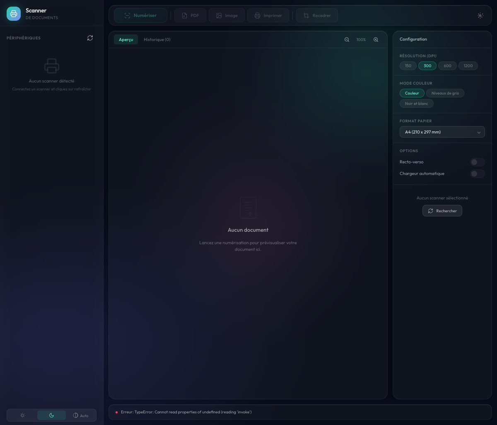
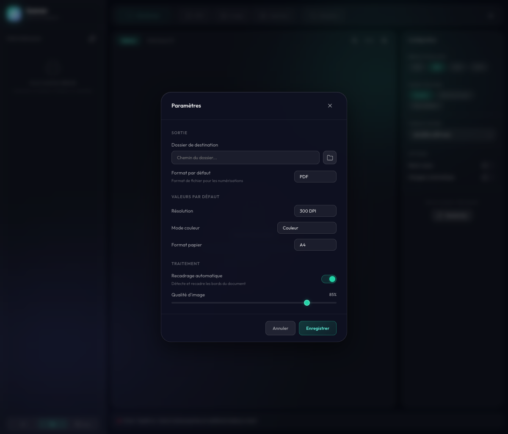

<p align="center">
  
</p>

<h1 align="center">Photon</h1>

<p align="center">
  <strong>Scanner intelligent de documents, natif et multi-plateforme</strong>
</p>

<p align="center">
  <a href="#fonctionnalités">Fonctionnalités</a> •
  <a href="#installation">Installation</a> •
  <a href="#utilisation">Utilisation</a> •
  <a href="#paramètres">Paramètres</a> •
  <a href="#raccourcis-clavier">Raccourcis</a> •
  <a href="#faq">FAQ</a>
</p>

<p align="center">
  <a href="https://v2.tauri.app"></a>
  <a href="https://react.dev"></a>
  <a href="https://www.typescriptlang.org"></a>
  <a href="https://www.rust-lang.org"></a>
  
  
  
  
</p>

---

## Présentation

**Photon** est une application desktop native haute performance pour la numérisation, le traitement intelligent et l'export de documents. Contrairement aux solutions cloud ou aux logiciels fournis par les fabricants, Photon fonctionne **100% en local** sur votre machine, avec un binaire léger (~8 Mo) et un accès direct aux périphériques via les API natives de chaque OS.

### Points forts

| | |
|---|---|
| **100% Natif** | Accès direct aux scanners via WIA (Windows), ImageCaptureCore (macOS) et SANE (Linux) |
| **Ultra léger** | Binaire ~8 Mo, consommation mémoire minimale grâce à Tauri 2 + Rust |
| **OCR intégré** | Reconnaissance de texte via Tesseract embarqué, 8 langues, aucune dépendance externe |
| **Intelligence** | Classification automatique de 12 types de documents + extraction de données |
| **Multi-pages** | Création de PDF multi-pages avec réordonnement par glisser-déposer |
| **Automatisation** | Moteur de règles configurable (conditions ET/OU, actions automatiques) |
| **Édition complète** | Rotation, recadrage, débruitage, redressement, ajustements temps réel |
| **Cross-platform** | Windows, macOS et Linux avec la même interface |
| **Bilingue** | Interface en français et anglais |
| **Open Source** | Licence MIT, contributions bienvenues |

---

## Fonctionnalités

### Numérisation

#### Scan unitaire

Connectez votre scanner, sélectionnez-le dans la barre latérale et cliquez sur **Scan** (ou `Ctrl+S`). Le document est numérisé et affiché instantanément dans l'aperçu.

```
Sélectionner scanner → Configurer (DPI, couleur, format) → Scan → Aperçu instantané
```

#### Numérisation par lot (Batch)

Numérisez plusieurs pages d'un coup avec le mode batch :

- Activez **Batch** dans le panneau de configuration
- Définissez le nombre de pages
- Chaque page est numérisée séquentiellement et ajoutée automatiquement

#### Profils de numérisation

<p align="center">
  
</p>

Sauvegardez vos configurations fréquentes en profils réutilisables :

- **Factures 300dpi N&B** : Noir et blanc, 300 DPI, A4
- **Photos 600dpi Couleur** : Couleur, 600 DPI, haute qualité
- **Documents rapides** : Niveaux de gris, 150 DPI

Clic droit sur un profil pour le supprimer. Créez-en autant que nécessaire.

#### Paramètres de numérisation

| Paramètre | Options disponibles |
|-----------|-------------------|
| **Résolution** | 150, 300, 600, 1200 DPI |
| **Mode couleur** | Couleur, Niveaux de gris, Noir & Blanc |
| **Format papier** | A4, A3, Letter, Legal |
| **Recto-verso** | Duplex activable si supporté par le scanner |
| **ADF** | Chargeur automatique de documents |

---

### OCR (Reconnaissance de texte)

<p align="center">
  
</p>

Extrayez le texte de vos documents numérisés avec l'OCR intégré :

- **Tesseract embarqué** : aucune installation externe nécessaire
- **8 langues** : Français, Anglais, Allemand, Espagnol, Italien, Portugais, Néerlandais, Bilingue (FR+EN)
- **PDF searchable** : couche texte invisible pour la recherche dans les lecteurs PDF
- **OCR automatique** optionnel après chaque numérisation
- **Copier-coller** du texte extrait en un clic

#### Langues OCR supportées

| Langue | Code |
|--------|------|
| Français | `fra` |
| Anglais | `eng` |
| Allemand | `deu` |
| Espagnol | `spa` |
| Italien | `ita` |
| Portugais | `por` |
| Néerlandais | `nld` |
| Bilingue FR+EN | `fra+eng` |

---

### Intelligence & Classification

Photon analyse automatiquement vos documents pour les classer et extraire les données clés.

#### Classification automatique

L'analyse identifie le type de document parmi **12 catégories** :

| Type | Exemples |
|------|----------|
| **Facture** | Factures fournisseurs, notes de frais |
| **Contrat** | Baux, contrats de travail, CGV |
| **Carte d'identité** | CNI, passeport, permis de conduire |
| **CV** | Curriculum vitae, lettres de motivation |
| **Ordonnance** | Prescriptions médicales |
| **Relevé bancaire** | Relevés de compte |
| **Bulletin de paie** | Fiches de salaire |
| **Devis** | Propositions commerciales |
| **Reçu** | Tickets de caisse, reçus |
| **Courrier** | Lettres, correspondance |
| **Formulaire** | Cerfa, déclarations |
| **Autre** | Documents non classifiés |

#### Extraction de données

L'analyse extrait automatiquement :

- **Montants** (TTC, HT, TVA)
- **Dates** (émission, échéance)
- **IBAN** et coordonnées bancaires
- **Emails** et **téléphones**
- **SIRET / SIREN**
- **Numéros de document** (facture, commande)

#### Suggestions intelligentes

Après analyse, Photon suggère :

- Un **nom de fichier** adapté au contenu
- Un **dossier** de classement
- Des **tags** pertinents

Cliquez sur **Appliquer les suggestions** pour tout valider en un clic.

---

### Règles d'automatisation

Créez des règles pour automatiser le traitement de vos documents :

#### Conditions disponibles

| Condition | Description |
|-----------|-------------|
| **Type de document** | Correspond à un type classifié (facture, contrat...) |
| **Nom contient** | Le nom du fichier contient un mot-clé |
| **Texte OCR contient** | Le texte extrait contient un mot-clé |
| **Confiance supérieure à** | Score de confiance de la classification |
| **Tag présent** | Un tag spécifique est assigné |
| **Date** | Critère sur la date du document |

#### Actions disponibles

| Action | Description |
|--------|-------------|
| **Renommer** | Renomme le fichier selon un pattern |
| **Déplacer** | Déplace vers un dossier spécifique |
| **Ajouter un tag** | Assigne un tag automatiquement |
| **Exporter en PDF** | Génère un PDF automatiquement |

Les règles supportent la logique **ET** (toutes les conditions) ou **OU** (au moins une condition).

---

### Édition d'image

<p align="center">
  
</p>

Le panneau d'édition offre un ensemble complet d'outils de traitement :

#### Rotation & Retournement

| Action | Raccourci |
|--------|-----------|
| Rotation 90° gauche | Bouton |
| Rotation 90° droite | Bouton |
| Rotation 180° | Bouton |
| Miroir horizontal | Bouton |
| Miroir vertical | Bouton |

#### Ajustements temps réel

Modifiez les paramètres d'image avec un aperçu en direct :

| Ajustement | Plage | Effet |
|------------|-------|-------|
| **Luminosité** | -100 à +100 | Éclaircir ou assombrir |
| **Contraste** | -100 à +100 | Accentuer les différences |
| **Saturation** | -100 à +100 | Intensité des couleurs |
| **Netteté** | 0 à +100 | Accentuation des détails |

Cliquez **Appliquer** pour valider ou **Annuler** pour revenir à l'original.

#### Traitements automatiques

| Traitement | Description |
|------------|-------------|
| **Recadrage auto** | Détecte et recadre les bords du document |
| **Redressement** (deskew) | Corrige l'inclinaison automatiquement |
| **Débruitage léger** | Filtre pour documents de qualité moyenne |
| **Débruitage fort** | Filtre pour documents anciens ou très bruités |
| **Blanchiment du fond** | Supprime les fonds colorés ou grisés |

---

### Documents multi-pages

Créez des documents PDF multi-pages en combinant plusieurs numérisations :

1. **Créez** un nouveau document multi-pages
2. **Ajoutez** des pages depuis vos numérisations
3. **Réordonnez** par glisser-déposer
4. **Exportez** en PDF unique

- Ajout de la page courante en un clic
- Suppression de pages individuelles
- Combinaison de documents existants en un seul PDF

---

### Export

Photon supporte plusieurs formats d'export :

| Format | Extension | Cas d'usage |
|--------|-----------|-------------|
| **PDF** | `.pdf` | Documents, archivage, partage |
| **PNG** | `.png` | Qualité maximale, transparence |
| **JPEG** | `.jpg` | Photos, taille réduite |
| **TIFF** | `.tiff` | Archivage professionnel |

#### Nommage automatique

Configurez un template de nommage avec les variables suivantes :

| Variable | Valeur |
|----------|--------|
| `{date}` | Date du jour (AAAA-MM-JJ) |
| `{time}` | Heure (HH-MM-SS) |
| `{counter}` | Compteur incrémental |
| `{dpi}` | Résolution utilisée |
| `{mode}` | Mode couleur |
| `{format}` | Format de sortie |

**Exemple** : `Scan_{date}_{time}` → `Scan_2026-02-17_14-30-00.pdf`

#### Dossier de surveillance

Activez l'export automatique : chaque numérisation est automatiquement enregistrée dans le dossier configuré.

#### Impression directe

Envoyez le document directement vers votre imprimante système sans passer par un logiciel tiers.

---

### Historique

Accédez facilement à vos numérisations passées :

- **Miniatures** de chaque document
- **Recherche full-text** par nom, date ou contenu OCR
- **Renommage** en double-cliquant
- **Duplication** d'un document existant
- **Suppression** individuelle
- **Menu contextuel** : renommer, dupliquer, ajouter aux pages, supprimer

---

### Tags et catégories

Organisez vos documents avec un système de tags :

- Créez des tags personnalisés avec **nom et couleur**
- Assignez-les manuellement ou automatiquement via les règles
- Filtrez vos documents par tag
- Les tags sont suggérés automatiquement par l'analyse intelligente

---

## Installation

### macOS

1. **Téléchargez** le fichier `.dmg` correspondant à votre Mac :
   - **Mac Intel** : `Photon_x64.dmg`
   - **Mac Apple Silicon** : `Photon_arm64.dmg`

2. **Ouvrez** le fichier `.dmg`

3. **Glissez** Photon dans le dossier Applications

4. **Premier lancement** : Clic droit → Ouvrir (contournement Gatekeeper)

5. **Installez Tesseract** (nécessaire pour l'OCR) :
   ```bash
   brew install tesseract tesseract-lang
   ```

### Windows

1. **Téléchargez** `Photon_Setup.exe` ou `Photon.msi`
2. **Exécutez** l'installateur
3. **Suivez** les instructions à l'écran
4. **Lancez** Photon depuis le menu Démarrer

> **Note** : Tesseract doit être installé séparément et ajouté au PATH système pour l'OCR.

### Linux

1. **Téléchargez** le paquet correspondant :
   - `.deb` pour Ubuntu/Debian
   - `.AppImage` pour toutes distributions

2. **Installez** les dépendances :

   ```bash
   # Ubuntu/Debian
   sudo apt install libsane-dev libtesseract-dev libleptonica-dev
   ```

3. **Installez** l'application :
   ```bash
   # Debian/Ubuntu
   sudo dpkg -i photon_*.deb

   # Ou AppImage
   chmod +x Photon_*.AppImage
   ./Photon_*.AppImage
   ```

### Compilation depuis les sources

```bash
# Prérequis : Node.js >= 18, Rust >= 1.70, dépendances Tauri 2

# Cloner le dépôt
git clone https://github.com/cyprienbrisset/document-scanner.git
cd document-scanner

# Installer les dépendances frontend
npm install

# Mode développement
npm run tauri dev

# Compilation production
npm run tauri build
```

Le binaire sera généré dans `src-tauri/target/release/bundle/`.

---

## Utilisation

### Premier lancement — Assistant d'accueil

<p align="center">
  
</p>

Au premier lancement, un assistant vous guide en **5 étapes** :

1. **Langue** — Choisissez français ou anglais
2. **Scanner** — Détection automatique de vos périphériques
3. **Dossier de sortie** — Où sauvegarder vos numérisations
4. **Test** — Lancez un scan de test pour vérifier la configuration
5. **Terminé** — Vous êtes prêt à utiliser Photon

L'assistant détecte automatiquement les scanners connectés. Si aucun n'est trouvé, vérifiez la connexion et cliquez sur **Rafraîchir**.

---

### Workflow quotidien

```
1. Placez votre document dans le scanner
2. Sélectionnez le scanner dans la barre latérale
3. Configurez si nécessaire (DPI, couleur, format)
4. Cliquez Scan (ou Ctrl+S)
5. Éditez si besoin (recadrage, rotation, ajustements)
6. Exportez en PDF, image ou imprimez directement
```

### Conseils pour de meilleurs résultats

- **Résolution 300 DPI** pour un bon compromis qualité/taille
- **600+ DPI** pour les documents contenant du texte fin ou des détails
- **Noir & Blanc** pour les documents texte (OCR plus précis, fichiers plus légers)
- **Recadrage auto** pour supprimer les marges du scanner
- **Redressement** si le document est placé légèrement de travers

---

### Tour guidé

Après l'onboarding, un **tour guidé en 7 étapes** vous présente l'interface :

1. **Vos scanners** — La barre latérale avec vos périphériques
2. **Scan** — Le bouton de numérisation
3. **PDF** — L'export en PDF
4. **OCR** — La reconnaissance de texte
5. **Analyse** — La classification intelligente
6. **Panneaux** — Config, Édition, Pages, Intelligence
7. **Paramètres** — Personnalisation de l'application

Le tour peut être fermé à tout moment avec le bouton **Fermer le guide**.

---

## Paramètres

Accédez aux paramètres via le bouton engrenage ou le panneau de configuration.

<p align="center">
  
</p>

### Général

| Paramètre | Description | Défaut |
|-----------|-------------|--------|
| **Langue** | Interface en français ou anglais | Français |
| **Dossier de sortie** | Répertoire de sauvegarde | Dossier Documents |
| **Format par défaut** | PDF, PNG, JPEG ou TIFF | PDF |

### Numérisation

| Paramètre | Description | Défaut |
|-----------|-------------|--------|
| **Résolution** | DPI par défaut | 300 |
| **Mode couleur** | Couleur, Niveaux de gris, N&B | Couleur |
| **Format papier** | A4, A3, Letter, Legal | A4 |
| **Recadrage auto** | Détection des bords après scan | Désactivé |

### Export

| Paramètre | Description | Défaut |
|-----------|-------------|--------|
| **Qualité** | Compression image (10-100%) | 85% |
| **Template de nommage** | Pattern pour les noms de fichiers | `Scan_{date}_{time}` |
| **Dossier de surveillance** | Export automatique vers ce dossier | Désactivé |

### Application

| Paramètre | Description | Défaut |
|-----------|-------------|--------|
| **OCR automatique** | Extraction de texte après chaque scan | Désactivé |
| **Langue OCR** | Langue de reconnaissance | Français |
| **Thème** | Sombre, Clair ou Automatique | Automatique |

---

## Raccourcis clavier

### Raccourcis globaux

| Raccourci | Action |
|-----------|--------|
| `Ctrl+S` | Lancer une numérisation |
| `Ctrl+Shift+S` | Enregistrer en PDF |
| `Ctrl+E` | Enregistrer en image |
| `Ctrl+P` | Imprimer |
| `Ctrl+O` | Lancer l'OCR |

---

## Dépannage

<details>
<summary><strong>Aucun scanner n'est détecté</strong></summary>

1. Vérifiez que le scanner est allumé et connecté (USB ou réseau)
2. **macOS** : le scanner doit être compatible ImageCaptureCore
3. **Windows** : vérifiez que le pilote WIA est installé
4. **Linux** : vérifiez que SANE est installé (`sudo apt install libsane-dev`) et que le scanner est listé (`scanimage -L`)
5. Cliquez sur **Rafraîchir** dans la barre latérale
6. Redémarrez Photon
</details>

<details>
<summary><strong>L'OCR ne fonctionne pas</strong></summary>

1. **macOS** : vérifiez que Tesseract est installé (`brew install tesseract tesseract-lang`)
2. **Windows** : vérifiez que Tesseract est dans le PATH système
3. **Linux** : installez les paquets (`sudo apt install libtesseract-dev libleptonica-dev`)
4. Vérifiez la langue OCR dans les paramètres
5. Un document de meilleure résolution (300+ DPI) améliore les résultats
</details>

<details>
<summary><strong>La qualité du scan est mauvaise</strong></summary>

1. Augmentez la résolution (600 DPI pour le texte fin)
2. Nettoyez la vitre du scanner
3. Utilisez le **redressement** si le document est de travers
4. Utilisez le **débruitage** pour les documents anciens
5. Utilisez le **blanchiment du fond** pour supprimer les fonds colorés
</details>

<details>
<summary><strong>L'application ne se lance pas</strong></summary>

**macOS :**
```
Clic droit sur Photon → Ouvrir (contournement Gatekeeper)
```

**Linux :**
```bash
# Vérifiez les permissions
chmod +x Photon_*.AppImage

# Vérifiez les dépendances
ldd /usr/bin/photon | grep "not found"
```

**Windows :**
- Essayez d'exécuter en tant qu'administrateur
- Vérifiez que les Visual C++ Redistributables sont installés
</details>

<details>
<summary><strong>Le PDF généré est trop lourd</strong></summary>

1. Réduisez la résolution (150 ou 300 DPI au lieu de 600)
2. Utilisez le mode **Niveaux de gris** au lieu de Couleur
3. Réduisez la **qualité** dans les paramètres (70% au lieu de 85%)
4. Utilisez le **recadrage auto** pour supprimer les marges inutiles
</details>

---

## FAQ

<details>
<summary><strong>Photon est-il gratuit ?</strong></summary>

Oui ! Photon est distribué sous licence MIT, 100% gratuit et open source.
</details>

<details>
<summary><strong>Mes documents sont-ils envoyés sur Internet ?</strong></summary>

**Non.** Tout le traitement (numérisation, OCR, classification, édition, export) est effectué **100% en local** sur votre machine. Aucune donnée ne quitte votre ordinateur. Photon ne contient aucune télémétrie.
</details>

<details>
<summary><strong>Quels scanners sont compatibles ?</strong></summary>

Photon utilise les API scanner natives de chaque OS :

| OS | API | Compatibilité |
|----|-----|---------------|
| **Windows** | WIA 2.0 | Tout scanner avec pilote WIA |
| **macOS** | ImageCaptureCore | Tout scanner reconnu par macOS |
| **Linux** | SANE | Tout scanner supporté par SANE |

En pratique, la plupart des scanners USB et réseau récents sont compatibles.
</details>

<details>
<summary><strong>Puis-je utiliser Photon sans scanner ?</strong></summary>

L'application est conçue pour fonctionner avec un scanner physique. Sans scanner connecté, vous pouvez toujours parcourir l'historique des documents précédemment numérisés.
</details>

<details>
<summary><strong>Comment ajouter une langue d'interface ?</strong></summary>

Photon supporte actuellement le français et l'anglais. Pour ajouter une langue :

1. Créez un fichier `src/locales/xx.json` (copie de `en.json`)
2. Traduisez toutes les clés (~360)
3. Ajoutez la langue dans `LanguageContext.tsx`
4. Soumettez une Pull Request
</details>

<details>
<summary><strong>Où sont stockées mes données ?</strong></summary>

| OS | Répertoire |
|----|-----------|
| **Windows** | `%APPDATA%/com.cyprienbrisset.document-scanner/` |
| **macOS** | `~/Library/Application Support/com.cyprienbrisset.document-scanner/` |
| **Linux** | `~/.local/share/com.cyprienbrisset.document-scanner/` |

En mode portable (`portable.marker` à côté du binaire), les données sont dans `data/`.
</details>

<details>
<summary><strong>Comment activer le mode portable ?</strong></summary>

Créez un fichier vide nommé `portable.marker` dans le même dossier que l'exécutable Photon. Au prochain lancement, les données seront stockées dans un dossier `data/` adjacent.
</details>

---

## Architecture

### Stack technique

```
Frontend : React 19 + TypeScript 5.8 + Vite 7
Backend  : Rust (édition 2021) + Tauri 2
OCR      : Tesseract (embarqué via tesseract-rs)
PDF      : printpdf 0.7
Image    : image 0.25
UI       : Design Frosted Touch (glassmorphisme)
```

### Backends natifs par plateforme

| Plateforme | API système | Méthode d'accès |
|------------|-------------|-----------------|
| **Windows** | WIA 2.0 (Windows Image Acquisition) | COM interop |
| **macOS** | ImageCaptureCore | Message passing Objective-C |
| **Linux** | SANE (Scanner Access Now Easy) | FFI dynamique (`libsane.so`) |

### Structure du projet

```
photon/
├── src/                              # Frontend React + TypeScript
│   ├── App.tsx                       # Composant racine, logique UI complète
│   ├── App.css                       # Design system glassmorphisme
│   ├── contexts/LanguageContext.tsx   # i18n synchrone, interpolation
│   ├── hooks/useFocusTrap.ts         # Focus trap pour modales (a11y)
│   ├── components/onboarding/        # Assistant + tour guidé
│   ├── utils/selectDirectory.ts      # Dialog sélection de dossier
│   └── locales/{fr,en}.json          # Traductions (~360 clés)
│
├── src-tauri/src/                    # Backend natif Rust
│   ├── lib.rs                        # 45+ commandes Tauri
│   ├── processing.rs                 # Recadrage, rotation, PDF, filtres
│   ├── storage.rs                    # Persistance JSON, mode portable
│   ├── ocr.rs                        # Intégration Tesseract
│   ├── intelligence.rs               # Classification, extraction, règles
│   └── scanner/{mod,wia,ica,sane}.rs # Backends scanner par plateforme
│
├── public/logo.svg                   # Logo vectoriel
├── screenshots/                      # Captures d'écran
└── ROADMAP.md                        # Fonctionnalités planifiées
```

---

## Contribuer

Les contributions sont les bienvenues ! Consultez la [Roadmap](ROADMAP.md) pour les fonctionnalités planifiées.

1. Fork le projet
2. Créez une branche (`git checkout -b feature/ma-fonctionnalite`)
3. Committez (`git commit -m 'Ajout de ma fonctionnalité'`)
4. Pushez (`git push origin feature/ma-fonctionnalite`)
5. Ouvrez une Pull Request

### Notes pour les contributeurs

- **Frontend** : composant monolithique `App.tsx` (source de vérité unique pour l'état UI)
- **Backend** : un module Rust par responsabilité (`scanner/`, `processing.rs`, `storage.rs`, `ocr.rs`, `intelligence.rs`)
- **i18n** : ajouter chaque clé dans `fr.json` ET `en.json`, utiliser `t("section.clé")`
- **Commandes** : déclarer `#[tauri::command]` dans `lib.rs`, enregistrer dans `.invoke_handler()`

---

## Licence

Distribué sous licence **MIT**. Voir [LICENSE](LICENSE) pour plus de détails.

---

<p align="center">
  Fait avec Rust et React par <strong>Cyprien Brisset</strong>
</p>

<p align="center">
  <sub>Construit avec <a href="https://v2.tauri.app">Tauri 2</a> · Propulsé par <a href="https://www.rust-lang.org">Rust</a> · Interface <a href="https://react.dev">React 19</a></sub>
</p>
